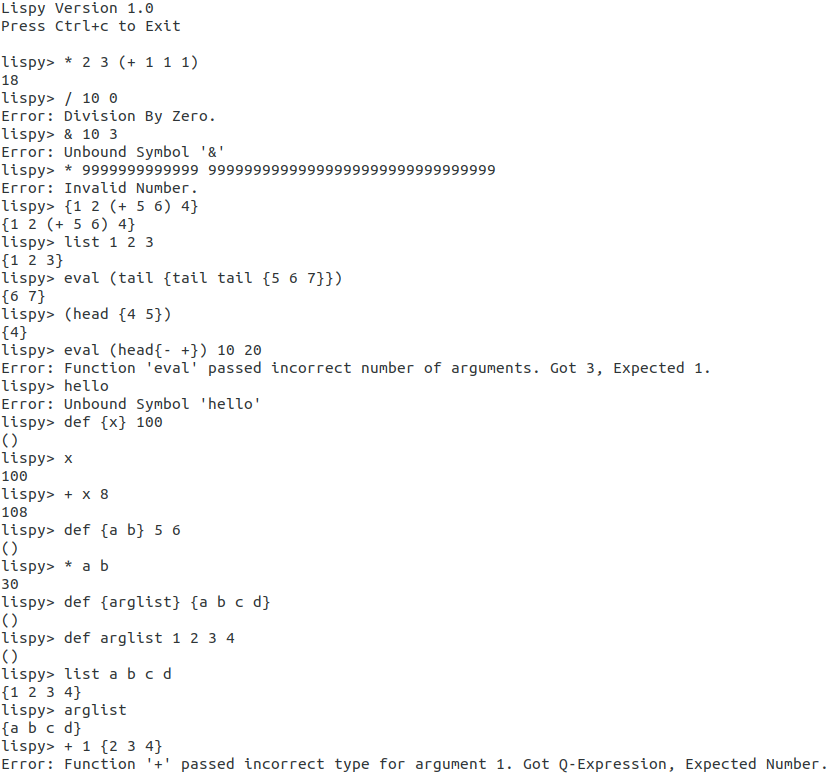
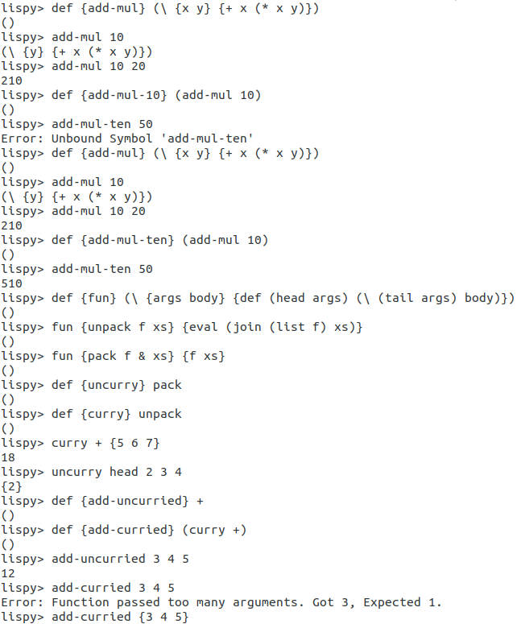

# Lispy
Following http://buildyourownlisp.com, I built a minimal dialect of Lisp in C language using Micro Parser Combinators (https://github.com/orangeduck/mpc).

HOW TO COMPILE: gcc -Wall Lispy.c mpc.c -o Lispy -lreadline -lm

HOW TO RUN: ./Lispy

## Screenshots:

